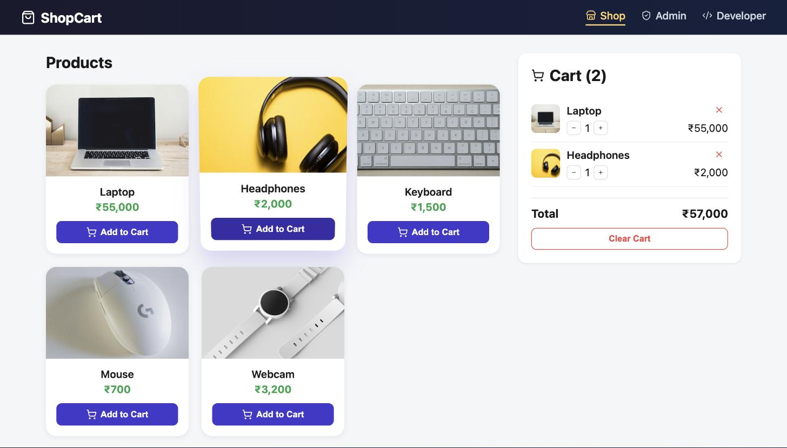
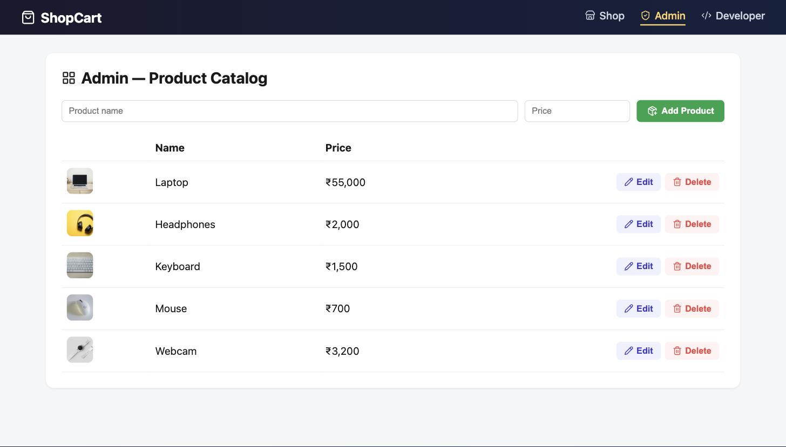
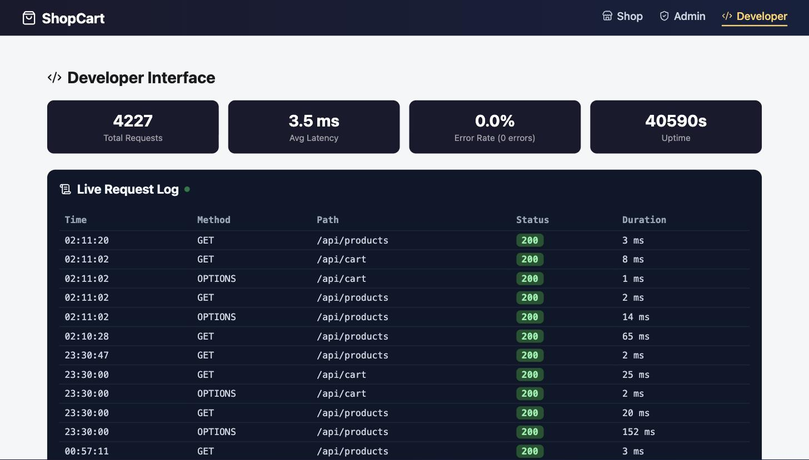

<div class="titlepage">
<div class="college">SSN College of Engineering</div>
<div class="recordtitle">LABORATORY RECORD</div>
<div class="subject">Subject: Web Application Development Laboratory</div>
<div class="exercise">Exercise 8: Shopping Cart Full-Stack Web Application (Monolith) &mdash; Vue.js, Spring Boot &amp; MongoDB</div>
<div class="submitted">
<div class="label">SUBMITTED BY</div>
Name: Vijayaraaghavan K S<br>
Register Number: 3122247001066<br>
Branch: Department of CSE<br>
Semester / Year: V Semester / III Year
<br><br>
Subject Code: ICS1511 &nbsp;&nbsp;&nbsp; Batch: 2024&ndash;2029
</div>
</div>

# 1. Problem Description

## Scenario

A Shopping Cart application that lets a user view products, add them to a
cart, update quantities, and remove items, backed by a single Spring Boot
service and MongoDB. Beyond the base exercise requirement, this
implementation was extended to demonstrate a **production-style monolith**:
three distinct interfaces (User, Admin, Developer), request-level
observability, an automated test suite, and a concurrency stress test &mdash;
so the codebase could realistically be handed to another developer to
maintain, extend, or debug.

## Why a Monolith Here

Assignment 8 is intentionally built as one Spring Boot application containing
Product, Cart, and Dev/observability concerns together, sharing a single
MongoDB database (`ShoppingCartDB`). This is the baseline architecture that
Exercise 9 (the mini-project) later splits into two independent
microservices &mdash; comparing the two makes the trade-offs between a monolith
and microservices concrete rather than theoretical.

## The Three Interfaces

| Interface | Route | Purpose |
|---|---|---|
| **User (Shop)** | `/` | Browse products with real photos, add to cart, adjust quantities, see running total |
| **Admin** | `/admin` | Full CRUD on the product catalog (add / edit / delete products) |
| **Developer** | `/dev` | Live-tailing request log and aggregate metrics (throughput, latency, error rate, uptime) for every API call the backend serves, plus a documented API reference table |

## Technology Stack

- Vue 3 (`<script setup>`), Vite scaffold, `pinia` for cart state, `vue-router@4` for the three interfaces, `lucide-vue-next` for icons
- Spring Boot 4.1.1 (Java 17 language level, run on JDK 21), layered Controller &rarr; Service &rarr; Repository
- MongoDB (database `ShoppingCartDB`; collections `products`, `cart`, `request_logs`)
- JUnit 5 + Mockito + MockMvc for the automated test suite
- A hand-written Java concurrency stress tester (`java.net.http.HttpClient` + `ExecutorService`) &mdash; no external load-testing tool required

## Directory Structure

```
ass8/
├── cart-backend/                  (Spring Boot, port 8082)
│   └── src/main/java/com/ssn/cartbackend/
│       ├── controller/  (ProductController, CartController, DevController)
│       ├── service/     (CartService)
│       ├── repository/  (ProductRepository, CartRepository, RequestLogRepository)
│       ├── model/       (Product, CartItem, RequestLog, Metrics)
│       ├── logging/     (RequestLoggingFilter)
│       └── tools/       (StressTester)
│   └── src/test/java/com/ssn/cartbackend/
│       ├── controller/ProductControllerTest.java
│       └── service/CartServiceTest.java
└── cart-frontend/                 (Vue 3 + Vite, port 5173)
    └── src/
        ├── views/   (Shop.vue, Admin.vue, Developer.vue)
        ├── stores/  (cart.js)
        ├── api/     (client.js)
        └── utils/   (productImage.js)
```

## Request Flow

```
Vue Shop/Admin/Developer views
      |
      v
api/client.js  --fetch()--> Spring Boot Controllers (/api/products, /api/cart, /api/dev)
      |                              |
      |                    RequestLoggingFilter (every request)
      |                              |
      v                              v
CartService / ProductRepository   request_logs collection (MongoDB)
      |
      v
ShoppingCartDB (products, cart)
```

# 2. Backend Source Code

## File: model/Product.java, model/CartItem.java

```java
@Data @NoArgsConstructor @AllArgsConstructor
@Document(collection = "products")
public class Product {
    @Id private String id;
    private String name;
    private double price;
}

@Data @NoArgsConstructor @AllArgsConstructor
@Document(collection = "cart")
public class CartItem {
    @Id private String id;
    private String productId;
    private String productName;
    private double price;
    private int quantity;
}
```

## File: service/CartService.java

```java
@Service
public class CartService {

    private final CartRepository cartRepository;
    private final ProductRepository productRepository;

    public CartService(CartRepository cartRepository, ProductRepository productRepository) {
        this.cartRepository = cartRepository;
        this.productRepository = productRepository;
    }

    public List<CartItem> getCart() { return cartRepository.findAll(); }

    public double getTotal() {
        return cartRepository.findAll().stream()
                .mapToDouble(item -> item.getPrice() * item.getQuantity())
                .sum();
    }

    // Adding a product that's already in the cart just bumps its quantity
    // instead of creating a duplicate cart row.
    public CartItem addToCart(String productId) {
        CartItem existing = cartRepository.findByProductId(productId);
        if (existing != null) {
            existing.setQuantity(existing.getQuantity() + 1);
            return cartRepository.save(existing);
        }
        Product product = productRepository.findById(productId).orElseThrow();
        CartItem item = new CartItem(null, product.getId(), product.getName(), product.getPrice(), 1);
        return cartRepository.save(item);
    }

    public CartItem updateQuantity(String cartItemId, int quantity) {
        CartItem item = cartRepository.findById(cartItemId).orElseThrow();
        item.setQuantity(quantity);
        return cartRepository.save(item);
    }

    public void removeItem(String cartItemId) { cartRepository.deleteById(cartItemId); }
    public void clearCart() { cartRepository.deleteAll(); }
}
```

## File: controller/ProductController.java (Admin CRUD)

```java
@RestController
@RequestMapping("/api/products")
@CrossOrigin(origins = "*")
public class ProductController {

    private final ProductRepository repository;
    public ProductController(ProductRepository repository) { this.repository = repository; }

    @GetMapping
    public List<Product> getAllProducts() { return repository.findAll(); }

    // Admin interface: add a new product to the catalog
    @PostMapping
    public Product createProduct(@RequestBody Product product) { return repository.save(product); }

    // Admin interface: edit name/price of an existing product
    @PutMapping("/{id}")
    public Product updateProduct(@PathVariable String id, @RequestBody Product updated) {
        return repository.findById(id).map(product -> {
            product.setName(updated.getName());
            product.setPrice(updated.getPrice());
            return repository.save(product);
        }).orElse(null);
    }

    // Admin interface: remove a product from the catalog
    @DeleteMapping("/{id}")
    public String deleteProduct(@PathVariable String id) {
        repository.deleteById(id);
        return "Product deleted";
    }
}
```

## File: logging/RequestLoggingFilter.java (Developer Interface backend)

```java
// Runs once per HTTP request. Wraps the rest of the filter chain in a timer,
// then writes one RequestLog row per request to Mongo -- this is how the
// Developer Interface gets a live feed of every call the backend has
// served, without needing an external logging/observability tool.
@Component
public class RequestLoggingFilter extends OncePerRequestFilter {

    private final RequestLogRepository repository;
    public RequestLoggingFilter(RequestLogRepository repository) { this.repository = repository; }

    @Override
    protected void doFilterInternal(HttpServletRequest request, HttpServletResponse response,
                                     FilterChain filterChain) throws ServletException, IOException {
        if (request.getRequestURI().startsWith("/api/dev")) {
            filterChain.doFilter(request, response);
            return;
        }
        long start = System.currentTimeMillis();
        String error = null;
        try {
            filterChain.doFilter(request, response);
        } catch (Exception e) {
            error = e.getMessage();
            throw e;
        } finally {
            long duration = System.currentTimeMillis() - start;
            repository.save(new RequestLog(null, request.getMethod(), request.getRequestURI(),
                    response.getStatus(), duration, error, Instant.now()));
        }
    }
}
```

## File: controller/DevController.java (Metrics endpoint)

```java
@RestController
@RequestMapping("/api/dev")
@CrossOrigin(origins = "*")
public class DevController {

    private final RequestLogRepository repository;
    public DevController(RequestLogRepository repository) { this.repository = repository; }

    @GetMapping("/logs")
    public List<RequestLog> getLogs() { return repository.findTop100ByOrderByTimestampDesc(); }

    @GetMapping("/metrics")
    public Metrics getMetrics() {
        List<RequestLog> all = repository.findAll();
        long total = all.size();
        long errors = all.stream().filter(l -> l.getStatus() >= 400).count();
        double avgLatency = all.stream().mapToLong(RequestLog::getDurationMs).average().orElse(0);
        long uptimeSeconds = ManagementFactory.getRuntimeMXBean().getUptime() / 1000;
        return new Metrics(total, errors, avgLatency, uptimeSeconds);
    }
}
```

# 3. Frontend Source Code

## File: api/client.js (Centralized endpoint documentation)

```javascript
const BASE = 'http://localhost:8082/api'

export const ENDPOINTS = [
  { method: 'GET', path: '/api/products', desc: 'List all products' },
  { method: 'POST', path: '/api/products', desc: 'Create a product (admin)' },
  { method: 'PUT', path: '/api/products/{id}', desc: 'Update a product (admin)' },
  { method: 'DELETE', path: '/api/products/{id}', desc: 'Delete a product (admin)' },
  { method: 'GET', path: '/api/cart', desc: 'Get current cart items' },
  { method: 'POST', path: '/api/cart/add/{productId}', desc: 'Add a product to the cart' },
  { method: 'PUT', path: '/api/cart/{cartItemId}', desc: 'Update a cart item quantity' },
  { method: 'DELETE', path: '/api/cart/{cartItemId}', desc: 'Remove one cart item' },
  { method: 'DELETE', path: '/api/cart', desc: 'Clear the entire cart' },
  { method: 'GET', path: '/api/dev/logs', desc: 'Last 100 request logs' },
  { method: 'GET', path: '/api/dev/metrics', desc: 'Aggregate request metrics' },
]

async function request(path, options = {}) {
  const res = await fetch(`${BASE}${path}`, { headers: { 'Content-Type': 'application/json' }, ...options })
  if (!res.ok) throw new Error(`${options.method || 'GET'} ${path} failed: ${res.status}`)
  const text = await res.text()
  return text ? JSON.parse(text) : null
}

export const api = {
  getProducts: () => request('/products'),
  addToCart: (productId) => request(`/cart/add/${productId}`, { method: 'POST' }),
  getLogs: () => request('/dev/logs'),
  getMetrics: () => request('/dev/metrics'),
  // ...full CRUD wrappers for products and cart
}
```

## File: stores/cart.js (Pinia)

```javascript
export const useCartStore = defineStore('cart', {
  state: () => ({ items: [], total: 0 }),
  getters: {
    itemCount: (state) => state.items.reduce((sum, item) => sum + item.quantity, 0),
  },
  actions: {
    async load() {
      this.items = await api.getCart()
      this.total = this.items.reduce((sum, item) => sum + item.price * item.quantity, 0)
    },
    async add(productId) { await api.addToCart(productId); await this.load() },
    async changeQuantity(item, delta) {
      const newQty = item.quantity + delta
      if (newQty <= 0) { await this.remove(item.id); return }
      await api.updateQuantity(item.id, newQty)
      await this.load()
    },
    async remove(id) { await api.removeItem(id); await this.load() },
    async clear() { await api.clearCart(); await this.load() },
  },
})
```

## File: utils/productImage.js (keyword-matched product photos)

```javascript
const images = import.meta.glob('../assets/products/*.jpg', { eager: true, import: 'default' })

const CATEGORY_KEYWORDS = [
  ['laptop', ['laptop', 'notebook', 'macbook']],
  ['headphones', ['headphone', 'headset', 'earphone', 'earbud']],
  ['keyboard', ['keyboard']],
  ['mouse', ['mouse']],
  // ...phone, watch, shoes, bag, speaker, camera, monitor, tablet
]

export function getProductImage(name) {
  const lower = (name || '').toLowerCase()
  for (const [category, keywords] of CATEGORY_KEYWORDS) {
    if (keywords.some((k) => lower.includes(k))) return images[`../assets/products/${category}.jpg`]
  }
  return images['../assets/products/generic.jpg']
}
```

## File: views/Shop.vue (3D tilt-on-hover interaction)

```javascript
// 3D tilt-on-hover, the classic "product card" interaction: rotate the card
// toward the cursor based on where inside it the mouse currently is.
function tilt(e) {
  const card = e.currentTarget
  const rect = card.getBoundingClientRect()
  const px = (e.clientX - rect.left) / rect.width
  const py = (e.clientY - rect.top) / rect.height
  const rotateY = (px - 0.5) * 16
  const rotateX = (0.5 - py) * 16
  card.style.transform = `perspective(800px) rotateX(${rotateX}deg) rotateY(${rotateY}deg) translateY(-6px) scale(1.03)`
}
```

# 4. Output Screenshots

## a. User Interface &ndash; Shop



Real product photography (keyword-matched per product name), a sticky cart
panel with live quantity controls, and an animated "Added to cart" toast on
every add &mdash; built to read like Amazon/Flipkart/Swiggy rather than a bare
functional demo.

## b. Admin Interface &ndash; Product Catalog



Full CRUD: add a new product, inline-edit an existing one, or delete it.
Every action here hits the same `/api/products` endpoints the Shop reads
from, so changes are reflected immediately.

## c. Developer Interface &ndash; Live Observability



A live-polling (3s interval) request log tail and aggregate metrics card
row &mdash; total requests, average latency, error rate, uptime &mdash; sourced
entirely from the `request_logs` MongoDB collection that `RequestLoggingFilter`
populates. No external APM tool was used; this is intentionally minimal
enough to explain end-to-end. The total request count shown (in the
thousands) reflects the cumulative traffic from the stress tests below.

# 5. Automated Test Suite (JUnit 5 + Mockito + MockMvc)

Two test classes cover the business layer and the web layer separately:

- **`CartServiceTest`** (6 tests) &mdash; mocks `CartRepository`/`ProductRepository`
  and verifies the cart's business rules directly: merging a duplicate
  add instead of creating a second row, correct total calculation, quantity
  updates, and delegation for remove/clear &mdash; with no real MongoDB involved.
- **`ProductControllerTest`** (4 tests) &mdash; uses `@WebMvcTest` + MockMvc to
  exercise the full HTTP contract (status codes, JSON shape) for create,
  read, update, and delete, with the repository mocked.

```bash
cd ass8/cart-backend
./mvnw test
```

```
Tests run: 1, Failures: 0, Errors: 0 -- CartBackendApplicationTests
Tests run: 4, Failures: 0, Errors: 0 -- ProductControllerTest
Tests run: 6, Failures: 0, Errors: 0 -- CartServiceTest

BUILD SUCCESS (11 tests, 0 failures, 0 errors)
```

One real Spring Boot 4 migration issue surfaced while writing these tests:
`@WebMvcTest` and `@AutoConfigureMockMvc` moved from
`org.springframework.boot.test.autoconfigure.web.servlet` (Boot 3.x) to
`org.springframework.boot.webmvc.test.autoconfigure` (Boot 4.x), and
`@MockBean` is now `@MockitoBean`. The `@WebMvcTest` slice also
auto-detects `RequestLoggingFilter` as a `@Component` `Filter` and tries to
construct it, so its `RequestLogRepository` dependency had to be mocked too
even though the test doesn't exercise logging.

# 6. Concurrency Stress Test

`tools/StressTester.java` is a plain-Java load generator &mdash; no JMeter or k6
install required &mdash; using a fixed-size `ExecutorService` (each thread
simulating one concurrent user) and `java.net.http.HttpClient` to fire N
requests at an endpoint and report throughput, latency percentiles, and
error rate.

```bash
java -cp target/classes com.ssn.cartbackend.tools.StressTester \
     http://localhost:8082/api/products 1000 50 GET
```

```
Total requests   : 1000
Successful (2xx/3xx): 1000
Failed (4xx/5xx/err): 0
Total time        : 211 ms
Throughput        : 4739.3 req/sec
Latency avg/min/max/p95: 9.7 / 1 / 106 / 103 ms
```

## A Real Bug Found While Stress Testing

The first version of the tool used `HttpClient.newHttpClient()`, which
defaults to `ForkJoinPool.commonPool()` for its internal async I/O
plumbing &mdash; a pool with parallelism capped near the CPU core count. Under
50+ concurrent requests that shared pool became a bottleneck: a handful of
requests stalled until the 10-second request timeout on every run,
regardless of how many total requests were fired. The fix was to give the
client its own dedicated executor sized to the concurrency level:

```java
ExecutorService clientExecutor = Executors.newFixedThreadPool(concurrency);
HttpClient client = HttpClient.newBuilder().executor(clientExecutor).build();
```

This surfaced a second bug: that dedicated executor is a pool of
**non-daemon** threads, so if it is never shut down the JVM never exits even
after `main()` finishes printing results. Fixed by calling
`clientExecutor.shutdown()` alongside the request-runner pool's own
shutdown. After both fixes, repeated 1000-request/50-concurrency runs
against the live backend completed cleanly with zero errors.

# 7. Learning Outcomes

This exercise went beyond a functional CRUD demo into what a shopping cart
service looks like when built for a real developer team to inherit. Key
takeaways:

- **Separation of concern by audience, not just by layer.** The User, Admin,
  and Developer interfaces all read/write the same `/api/products` and
  `/api/cart` endpoints, but present entirely different views of the same
  data &mdash; a pattern common in real SaaS products (customer app vs. admin
  console vs. internal ops dashboard).
- **Observability doesn't require an external tool.** A single
  `OncePerRequestFilter` writing to a Mongo collection, plus one aggregation
  endpoint, gave a genuinely useful live request log and metrics dashboard
  with about 60 lines of code.
- **Mockito/MockMvc test doubles let you verify business rules and HTTP
  contracts independently of MongoDB**, which is both faster and more
  precise than testing through the full stack every time.
- **Load testing finds real concurrency bugs that unit tests can't.** The
  `ForkJoinPool.commonPool()` bottleneck and the non-daemon-executor JVM
  hang were both discovered only once the tool was actually run under
  concurrent load &mdash; a direct, hands-on lesson in why production systems
  get load-tested before release, not just unit-tested.
