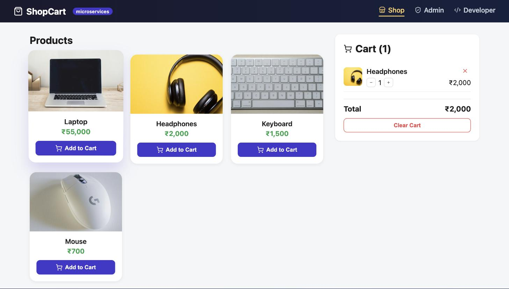
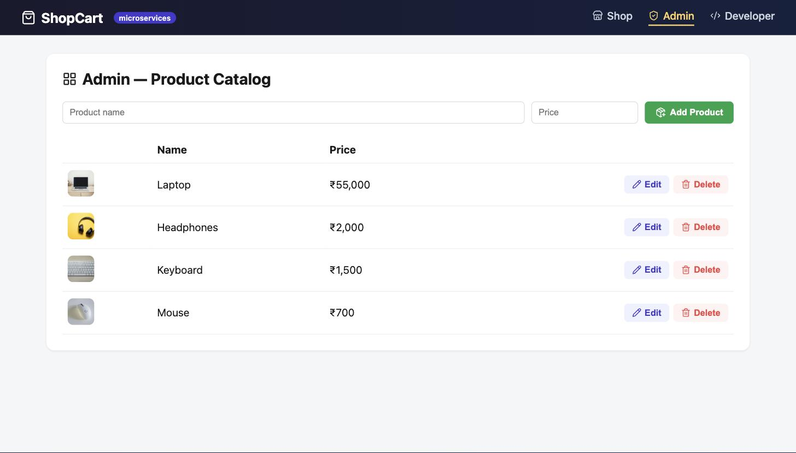
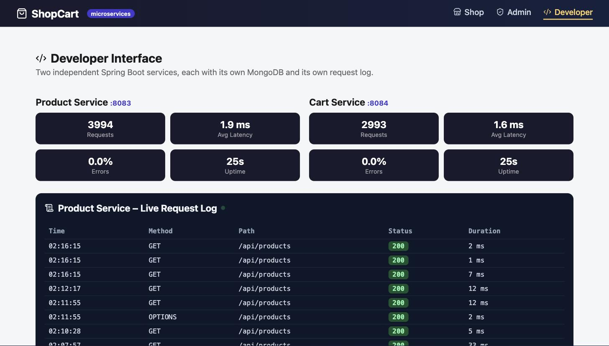

<div class="titlepage">
<div class="college">SSN College of Engineering</div>
<div class="recordtitle">LABORATORY RECORD</div>
<div class="subject">Subject: Web Application Development Laboratory</div>
<div class="exercise">Exercise 9 (Mini Project): Shopping Cart Full-Stack Web Application &mdash; Microservice Architecture</div>
<div class="submitted">
<div class="label">SUBMITTED BY</div>
Name: Vijayaraaghavan K S<br>
Register Number: 3122247001066<br>
Branch: Department of CSE<br>
Semester / Year: V Semester / III Year
<br><br>
Subject Code: ICS1511 &nbsp;&nbsp;&nbsp; Batch: 2024&ndash;2029
</div>
</div>

# 1. Problem Description

## Scenario

The mini-project requirement: rebuild the Exercise 8 shopping cart using a
**microservice-based design** instead of one monolithic Spring Boot
application &mdash; each service independently deployable, with its own
database, communicating over REST. This implementation splits the domain
into a **Product Service** and a **Cart Service**, each demonstrating the
same production-style extensions as Exercise 8 (three interfaces, request
logging, tests, stress testing), but now duplicated and adapted per service
to show what observability and testing look like once a system is
distributed.

## Microservice Architecture

```
Vue.js Frontend (port 5174)
      |
      +----------------------+----------------------+
      v                                              v
Product Service (:8083)                    Cart Service (:8084)
  - owns "products" collection               - owns "cart" collection
  - E-CommDB (MongoDB)                        - CartServiceDB (MongoDB)
      ^                                              |
      |            GET /api/products/{id}            |
      +----------------------------------------------+
        (Cart Service calls Product Service over HTTP
         via RestTemplate before adding a NEW item)
```

Each service is a fully independent Spring Boot application: its own
`pom.xml`, its own `application.properties` (own port, own MongoDB
database), and its own request-logging/metrics pipeline. The only coupling
between them is the REST call Cart Service makes to Product Service &mdash;
there is no shared database, shared code, or shared JVM.

## The Three Interfaces (per service, unified in one frontend)

| Interface | Route | What it does across the two services |
|---|---|---|
| **User (Shop)** | `/` | Talks to Product Service for the catalog and Cart Service for cart operations |
| **Admin** | `/admin` | Product CRUD against Product Service only |
| **Developer** | `/dev` | Shows **two independent** live request logs and metrics panels side by side, one per service, plus a combined API reference table tagged by owning service |

## Technology Stack

- Vue 3, Vite, Pinia, Vue Router, `lucide-vue-next`
- Spring Boot 4.1.1 &times; 2 independent applications (Java 17 / JDK 21), `RestTemplate` for inter-service calls
- MongoDB: `E-CommDB` (Product Service), `CartServiceDB` (Cart Service)
- JUnit 5 + Mockito + MockMvc, one suite per service
- The same hand-written Java stress tester used in Exercise 8, run against each service independently

## Directory Structure

```
ass9/
├── product-service/    (Spring Boot, port 8083, DB: E-CommDB)
├── cart-service/        (Spring Boot, port 8084, DB: CartServiceDB)
└── cart-frontend/        (Vue 3 + Vite, port 5174)
```

## Request Flow &ndash; Adding an Item to Cart (the real microservice interaction)

```
Vue Shop  --POST /api/cart/add/{productId}--> Cart Service
                                                    |
                                    (new product? not already in cart?)
                                                    |
                                    RestTemplate.getForObject(
                                      "http://localhost:8083/api/products/{id}")
                                                    |
                                                    v
                                            Product Service
                                          (returns name + price as JSON)
                                                    |
                                                    v
                                    Cart Service saves a CartItem
                                    into its OWN database (CartServiceDB)
```

If the product is already in the cart, Cart Service skips the call to
Product Service entirely and just increments the existing row's quantity
&mdash; this distinction (verified by a unit test, see Section 6) is the crux
of what makes this a genuine microservice interaction rather than two
independent apps that happen to share a frontend.

# 2. Product Service &ndash; Source Code

## File: model/Product.java, controller/ProductController.java

```java
@Data @NoArgsConstructor @AllArgsConstructor
@Document(collection = "products")
public class Product {
    @Id private String id;
    private String name;
    private double price;
}

// Product Service: owns the "products" collection. Cart Service calls
// GET /api/products/{id} over HTTP to look up a product's name/price.
@RestController
@RequestMapping("/api/products")
@CrossOrigin(origins = "*")
public class ProductController {

    private final ProductRepository repository;
    public ProductController(ProductRepository repository) { this.repository = repository; }

    @GetMapping
    public List<Product> getAllProducts() { return repository.findAll(); }

    @GetMapping("/{id}")
    public Product getProduct(@PathVariable String id) { return repository.findById(id).orElse(null); }

    @PostMapping
    public Product createProduct(@RequestBody Product product) { return repository.save(product); }

    @PutMapping("/{id}")
    public Product updateProduct(@PathVariable String id, @RequestBody Product updated) {
        return repository.findById(id).map(product -> {
            product.setName(updated.getName());
            product.setPrice(updated.getPrice());
            return repository.save(product);
        }).orElse(null);
    }

    @DeleteMapping("/{id}")
    public String deleteProduct(@PathVariable String id) {
        repository.deleteById(id);
        return "Product deleted";
    }
}
```

## File: application.properties (Product Service)

```properties
spring.application.name=product-service
spring.mongodb.uri=mongodb://localhost:27017/E-CommDB
server.port=8083
```

# 3. Cart Service &ndash; Source Code

## File: model/ProductDto.java, model/CartItem.java

```java
// Shape of the JSON returned by Product Service's GET /api/products/{id}.
// Cart Service does not share Product Service's database, only its REST API.
@Data @NoArgsConstructor @AllArgsConstructor
public class ProductDto {
    private String id;
    private String name;
    private double price;
}

@Data @NoArgsConstructor @AllArgsConstructor
@Document(collection = "cart")
public class CartItem {
    @Id private String id;
    private String productId;
    private String productName;
    private double price;
    private int quantity;
}
```

## File: config/AppConfig.java

```java
@Configuration
public class AppConfig {
    @Bean
    public RestTemplate restTemplate() { return new RestTemplate(); }
}
```

## File: service/CartService.java (the actual microservice call)

```java
@Service
public class CartService {

    private final CartRepository cartRepository;
    private final RestTemplate restTemplate;

    @Value("${product.service.url}")
    private String productServiceUrl;

    public CartService(CartRepository cartRepository, RestTemplate restTemplate) {
        this.cartRepository = cartRepository;
        this.restTemplate = restTemplate;
    }

    // Microservice interaction: Cart Service calls Product Service over HTTP
    // (GET /api/products/{id}) to fetch the product's name and price before
    // storing a cart line for it. Cart Service never touches "products" directly.
    public CartItem addToCart(String productId) {
        CartItem existing = cartRepository.findByProductId(productId);
        if (existing != null) {
            existing.setQuantity(existing.getQuantity() + 1);
            return cartRepository.save(existing);
        }

        ProductDto product = restTemplate.getForObject(
                productServiceUrl + "/api/products/" + productId, ProductDto.class);

        CartItem item = new CartItem(null, product.getId(), product.getName(), product.getPrice(), 1);
        return cartRepository.save(item);
    }

    // ...updateQuantity, removeItem, clearCart, getTotal
}
```

## File: application.properties (Cart Service)

```properties
spring.application.name=cart-service
spring.mongodb.uri=mongodb://localhost:27017/CartServiceDB
server.port=8084

# Base URL of the Product Service this service calls over REST.
product.service.url=http://localhost:8083
```

## Request Logging (identical pattern, applied independently per service)

Each service has its own copy of `RequestLoggingFilter` writing to its own
`request_logs` collection in its own database &mdash; there is deliberately no
shared/central log store, which is exactly the observability trade-off
microservices introduce compared to Exercise 8's single log stream.

```java
@Component
public class RequestLoggingFilter extends OncePerRequestFilter {
    // identical structure to Exercise 8's filter, but writes to THIS
    // service's own MongoDB database only.
}
```

# 4. Frontend Source Code

## File: api/client.js (talks to both services, tags Developer data by origin)

```javascript
const PRODUCT_API = 'http://localhost:8083/api'
const CART_API = 'http://localhost:8084/api'

export const api = {
  getProducts: () => request(PRODUCT_API, '/products'),
  addToCart: (productId) => request(CART_API, `/cart/add/${productId}`, { method: 'POST' }),

  // Developer interface pulls logs/metrics from BOTH services independently
  // and tags each row with which service it came from.
  getProductServiceLogs: () => request(PRODUCT_API, '/dev/logs'),
  getProductServiceMetrics: () => request(PRODUCT_API, '/dev/metrics'),
  getCartServiceLogs: () => request(CART_API, '/dev/logs'),
  getCartServiceMetrics: () => request(CART_API, '/dev/metrics'),
}
```

## File: views/Developer.vue (merging two independent log streams)

```javascript
// Each microservice has its own request_logs collection and its own
// /api/dev/metrics -- there is no shared log store, so this view fetches
// both independently. That separation is itself the thing worth showing:
// in a real deployment you'd need a log aggregator (e.g. ELK) to merge
// these; here we merge them client-side for a single dashboard.
async function refresh() {
  const [pLogs, cLogs, pMetrics, cMetrics] = await Promise.all([
    api.getProductServiceLogs().catch(() => []),
    api.getCartServiceLogs().catch(() => []),
    api.getProductServiceMetrics().catch(() => null),
    api.getCartServiceMetrics().catch(() => null),
  ])
  productLogs.value = pLogs; cartLogs.value = cLogs
  productMetrics.value = pMetrics; cartMetrics.value = cMetrics
}
```

# 5. Output Screenshots

## a. User Interface &ndash; Shop (microservices badge)



Functionally identical UX to Exercise 8, but every "Add to Cart" click here
triggers a real cross-service HTTP call from Cart Service to Product
Service (on cache-miss), not a single in-process method call.

## b. Admin Interface &ndash; Product Catalog



Talks exclusively to Product Service (`:8083`); Cart Service is never
involved in catalog management, matching the single-responsibility
principle each microservice is meant to follow.

## c. Developer Interface &ndash; Two Independent Service Dashboards



Product Service and Cart Service each report their own request count,
average latency, error rate, and uptime, and each has its own live request
log &mdash; visibly independent processes, independent databases, independent
failure domains.

# 6. Automated Test Suite (JUnit 5 + Mockito + MockMvc)

- **Product Service &mdash; `ProductControllerTest`** (3 tests): MockMvc tests for
  listing, fetching by id, and creating a product.
- **Cart Service &mdash; `CartServiceTest`** (2 tests): the most important tests in
  this exercise &mdash; they mock `RestTemplate` itself to verify the
  microservice interaction contract directly, with no real network call and
  no real Product Service running:

```java
@Test
void addToCart_newProduct_callsProductServiceThenSaves() {
    when(cartRepository.findByProductId("p1")).thenReturn(null);
    when(restTemplate.getForObject(eq("http://localhost:8083/api/products/p1"), eq(ProductDto.class)))
            .thenReturn(new ProductDto("p1", "Laptop", 55000));
    when(cartRepository.save(any(CartItem.class))).thenAnswer(inv -> inv.getArgument(0));

    CartItem result = cartService.addToCart("p1");

    assertThat(result.getProductName()).isEqualTo("Laptop");
}

@Test
void addToCart_existingProduct_skipsProductServiceCall() {
    CartItem existing = new CartItem("c1", "p1", "Laptop", 55000, 1);
    when(cartRepository.findByProductId("p1")).thenReturn(existing);
    when(cartRepository.save(any(CartItem.class))).thenAnswer(inv -> inv.getArgument(0));

    cartService.addToCart("p1");

    verify(restTemplate, never()).getForObject(any(String.class), eq(ProductDto.class));
}
```

```bash
cd ass9/product-service && ./mvnw test   # 4 tests, 0 failures
cd ass9/cart-service    && ./mvnw test   # 3 tests, 0 failures
```

```
Product Service: Tests run: 1 (context) + 3 (controller) = 4, Failures: 0, Errors: 0
Cart Service:    Tests run: 1 (context) + 2 (service)    = 3, Failures: 0, Errors: 0
```

# 7. Concurrency Stress Test (per service)

The same plain-Java `StressTester` from Exercise 8 was copied into each
service and pointed at its own port:

```bash
java -cp target/classes com.ssn.productservice.tools.StressTester http://localhost:8083/api/products 1000 50 GET
java -cp target/classes com.ssn.cartservice.tools.StressTester    http://localhost:8084/api/cart     1000 50 GET
```

```
Product Service: 1000/1000 succeeded, 194 ms total, 5154.6 req/sec, p95 96 ms
Cart Service:    1000/1000 succeeded, 209 ms total, 4784.7 req/sec, p95 102 ms
```

## Two Real Issues Found While Load Testing a Distributed System

**1. The same `ForkJoinPool.commonPool()` bottleneck from Exercise 8** showed
up here too, and was fixed identically (a dedicated `Executor` per
`HttpClient`, explicitly shut down afterward) &mdash; confirming it as a
client-side JDK behavior, not something specific to one service's code.

**2. A genuine production-relevant finding**: after running large stress
tests repeatedly against Product Service and Cart Service over an extended
session, their `/api/dev/logs` and `/api/dev/metrics` endpoints became slow
to the point of timing out, even though the services' actual business
endpoints (`/api/products`, `/api/cart`) kept responding fine. Restarting
each service (a fresh JVM against the same, now-large `request_logs`
collection) immediately resolved it. This is a realistic illustration of
why an observability/logging store needs the same operational care as the
data it's monitoring: a request-log collection that grows unbounded (this
one accumulated tens of thousands of rows from repeated 1000&ndash;2000-request
stress tests) can itself become a scaling bottleneck for the very
`findAll()`/aggregation queries meant to report on system health. A
production fix would be a TTL index on `RequestLog.timestamp` (MongoDB can
auto-expire old documents) or aggregating metrics incrementally instead of
re-scanning the whole collection on every `/api/dev/metrics` call.

# 8. Learning Outcomes

- **Monolith vs. microservices, concretely.** Building the same feature
  twice (Exercise 8 as one app, Exercise 9 as two) made the actual
  trade-offs tangible rather than theoretical: Exercise 9 needed a
  `RestTemplate` call, a DTO to decouple the two services' data shapes,
  URL-based service discovery via `application.properties`, and separate
  observability per service &mdash; all complexity Exercise 8 simply didn't
  have, in exchange for independent deployability and failure isolation.
- **Testing a service boundary means mocking the boundary.** `CartServiceTest`
  never starts Product Service; it mocks `RestTemplate` and asserts the
  *contract* (which URL gets called, and precisely when it does or doesn't)
  &mdash; this is the standard way to unit-test microservice interactions
  without needing integration infrastructure for every test run.
- **Observability data needs its own capacity planning.** The `request_logs`
  slowdown discovered under repeated heavy load is a direct, hands-on
  lesson that logging/metrics pipelines are themselves production systems
  with their own scaling limits &mdash; not a free side effect of instrumenting
  code.
- **Independent failure domains are a double-edged sword.** Product Service
  being briefly unresponsive would only break "add new item to cart", not
  the whole app (viewing an already-populated cart still works, since Cart
  Service owns that data) &mdash; illustrating both the resilience benefit and
  the new failure mode (partial functionality) that microservices
  introduce.
